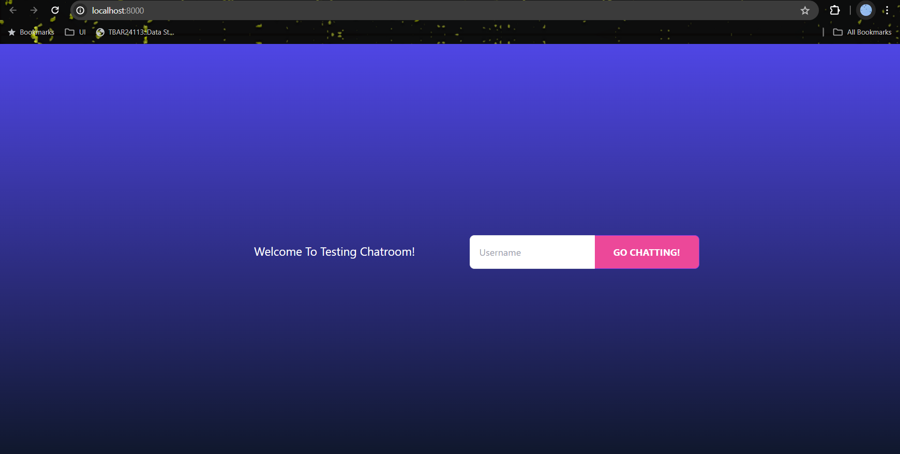
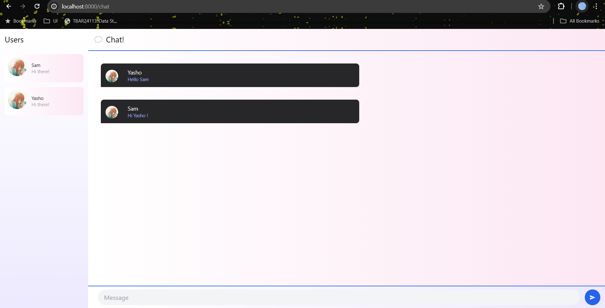

# YewChat 💬

> Source code for [Let’s Build a Websocket Chat Project With Rust and Yew 0.19 🦀](https://fsjohnny.medium.com/lets-build-a-websockets-project-with-rust-and-yew-0-19-60720367399f)

Nama: Samuel Taniel Mulyadi
NPM : 2206081805

### **Experiment 3.1: Original code**

Some of the images didn't load but later in the modification it did load, it was just connection issue in these pictures.

### **Experiment 3.2: Be Creative!**

I was cooking. I change the interface to look more attractive, added text into the login page and change the colors. I also change the colors on the chat interface and make the profile picture icon to animated gif by changing the url and it's probably more better than using unknown url from the original which doesn't even load TT. Sorry for any mistakes, thank you. 